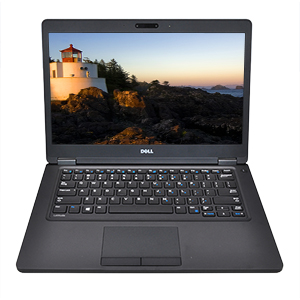

# latitude-5280-Hackintosh

### Computer Spec:

| Component        | Brank                              |
| ---------------- | ---------------------------------- |
| CPU              | Intel I5 7300U (Kabylake)          |
| iGPU             | Intel® Graphics HD 630             |
| Lan              | Intel 1219                         |
| Audio            | Realtek ALC225                     |
| Ram              | 16 GB DDR4 2400 Mhz                |
| Wifi + Bluetooth | Intel (7265)                       |
| SSD              | SAMSUNG 970                        |
| SmBios           | MacBookPro 14,1                    |
| BootLoader       | OpenCore                           |
| macOS            | Ventura                            |
